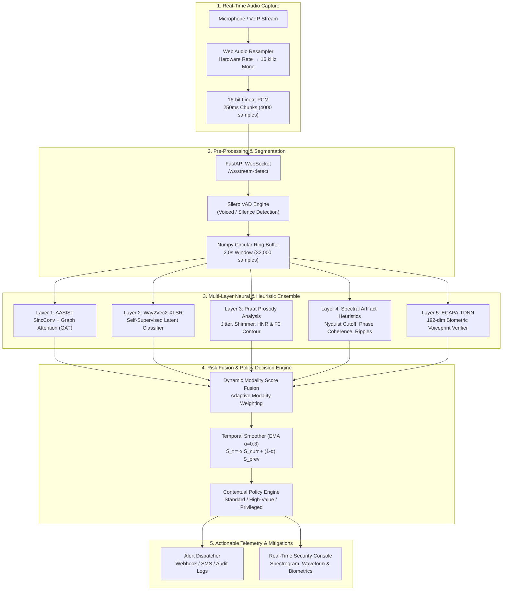

# 🛡️ CYPHEX — Real-Time Voice Integrity & Anti-Spoofing Framework
### *Advanced Multi-Layer AI Framework for Mitigating Synthetic Audio & Deepfake Impersonation*
**Smart India Hackathon (SIH 2026)**

---

## 📌 Executive Summary

Recent advances in diffusion vocoders and zero-shot neural speech synthesis have enabled malicious actors to clone executive and authority voices with under 3 seconds of reference audio. Traditional authentication (caller ID, callback verification, voice familiarity) fails in high-pressure financial and authorization workflows.

**CYPHEX** provides an enterprise-grade, defense-in-depth voice integrity verification platform that analyzes live audio streams in real time. Processing continuous **250ms chunks** over a **2.0s sliding window**, CYPHEX computes multi-modal acoustic, prosodic, and biometric scores, outputting an authoritative, temporally smoothed risk verdict with **sub-300ms latency**.

---

## 🏗️ System Architecture



---

## 🔬 Multi-Layer Detection Modalities

| Layer | Technique | Detection Target | Processing Time |
|:------|:----------|:-----------------|:----------------|
| **1. Acoustic Anti-Spoofing** | **AASIST** (SincNet + Graph Attention) | Artifacts from Mel-spectrogram inversion & vocoder phase errors | ~20 ms |
| **2. Self-Supervised Latents** | **Wav2Vec2-XLSR-53** Fine-Tuned | Latent temporal inconsistencies in synthetic phonemes | ~45 ms |
| **3. Prosodic Biomarkers** | **Parselmouth / Praat Engine** | Unnatural micro-stability: Jitter (<0.25%), Shimmer (<0.80%), HNR (>24 dB) | ~15 ms |
| **4. Spectral Heuristics** | **STFT & Phase Analysis** | High-frequency cutoff (12-16 kHz drop), checkerboard transposed-conv artifacts | ~10 ms |
| **5. Biometric Identity** | **SpeechBrain ECAPA-TDNN** | Cosine distance from AES-256 encrypted enrolled speaker voiceprint | ~30 ms |

---

## 📊 Mathematical Score Formulation

The combined synthetic probability $S$ is calculated via dynamically normalized multi-modal fusion:

$$S = \frac{\sum_{i=1}^{M} w_i \cdot s_i}{\sum_{i=1}^{M} w_i} + \Delta_{\text{context}}$$

Where:
- $w_{\text{AASIST}} = 0.35$ (Primary acoustic anti-spoof)
- $w_{\text{Wav2Vec2}} = 0.25$ (Self-supervised representations)
- $w_{\text{Prosody}} = 0.20$ (Prosody deviation)
- $w_{\text{Spectral}} = 0.20$ (Phase & high-freq heuristics)
- $w_{\text{Speaker}} = 0.20$ (Active only when a VIP speaker identity is being verified)
- $\Delta_{\text{context}}$ applies context adjustments (e.g. $+0.08$ for VoIP, $+0.05$ for anomalous hours)

Temporal stability is maintained via an Exponential Moving Average (EMA) to prevent transient frame flickering:

$$S_t = \alpha \cdot S + (1 - \alpha) \cdot S_{t-1}, \quad \text{where } \alpha = 0.30$$

---

## 🚀 Quick Start

### 1. Prerequisites
- **Python 3.11+**
- **Node.js 18+** & npm
- (Optional) Docker & Docker Compose

### 2. Backend Setup
```bash
cd d:\cyphex\backend

# Install dependencies
pip install -r requirements.txt

# Start FastAPI Uvicorn server
uvicorn app.main:app --host 0.0.0.0 --port 8000 --reload
```
API Documentation will be accessible at: `http://localhost:8000/docs`

### 3. Frontend Dashboard Setup
```bash
cd d:\cyphex\frontend

# Install dependencies
npm install

# Launch Vite development server
npm run dev
```
Dashboard will be available at: `http://localhost:5173`

### 4. Running with Docker Compose (PostgreSQL 16 + Redis 7 + Backend + Frontend)
```bash
cd d:\cyphex
docker-compose up --build
```
- Frontend UI: `http://localhost:3000`
- Backend API: `http://localhost:8000`
- PostgreSQL 16: `localhost:5432` (db: `cyphex`, user: `cyphex`)
- Redis 7: `localhost:6379`

> [!TIP]
> **Zero-Configuration Fallback**: If running without Docker or a local PostgreSQL instance, CYPHEX automatically detects connection availability and falls back to a high-performance local SQLite database (`cyphex.db`) with zero manual configuration required.

---

## 🔑 Default Evaluation Credentials
For instant demonstration and evaluation:
- **SOC Operator**: `admin`
- **Password**: `CyphexSOC#2026!`
- **Role**: `ADMIN` (Level 4 Clearance)
- Or click the **⚡ Auto-fill SOC Admin** button inside the Operator Login modal.

---

## 📡 API Reference

### Real-Time Streaming Detection
- **`WS /ws/stream-detect`**
  - **Query Parameters**:
    - `session_id` *(optional)*: Session UUID
    - `profile` *(optional)*: `STANDARD` | `HIGH_VALUE_TRANSACTION` | `PRIVILEGED_ACCESS`
    - `speaker_id` *(optional)*: Target enrolled speaker UUID for 1:1 biometric authentication
    - `threat_type` *(optional)*: Simulation threat vector ID (`ceo_fraud_wire`, `vocoder_cutoff_attack`, etc.)
  - **Payload**: Raw 16-bit Little-Endian Linear PCM bytes (16,000 Hz, mono)
  - **Response**: JSON telemetry stream with scores, prosodic metrics, and decisions

### SOC Operator Authentication & RBAC
- **`POST /api/v1/auth/login`**: Authenticate SOC operator, returns JWT bearer token
- **`POST /api/v1/auth/register`**: Register new SOC analyst (salted PBKDF2-HMAC-SHA256)
- **`GET /api/v1/auth/me`**: Validate active JWT session and fetch clearance level
- **`POST /api/v1/auth/api-key`**: Generate scoped API key for enterprise VoIP PBX integration

### Attack Simulation Suite
- **`GET /api/v1/demo/scenarios`**: Retrieve curated synthetic voice threat scenarios:
  1. *CEO Urgent Wire Transfer ($2.4M)* — HiFi-GAN neural clone with prosodic robotic flatness
  2. *VIP Spoof with High-Frequency Vocoder Void* — FastSpeech2 with >7.2 kHz spectral cutoff
  3. *Genuine Executive Strategy Review* — Authentic human voice with natural micro-tremors
- **`GET /api/v1/demo/audio/{scenario_id}`**: Synthesizes and streams 16-bit linear PCM audio for live in-browser playback and real-time detection testing

### REST Inspection & Management
- **`POST /api/v1/analyze`**: Batch forensic audio upload (`.wav`, `.flac`, `.mp3`) returning comprehensive deepfake report
- **`POST /api/v1/speakers/enroll`**: Upload reference speech sample to register VIP biometric voiceprint (AES-256 encrypted)
- **`GET /api/v1/speakers`**: List all enrolled speaker profiles
- **`POST /api/v1/speakers/{speaker_id}/verify`**: Verify test audio against registered voiceprint
- **`GET /api/v1/alerts/history`**: Query audit trail of high-risk security incidents
- **`GET /health`**: Granular model and infrastructure health status

---

## 🔒 Security & Privacy Compliance (DPDP Act 2023)
- **Zero Raw Audio Retention**: Raw voice streams exist only transiently in RAM circular buffers and are discarded after inference.
- **Biometric Encryption**: Speaker voiceprints are stored encrypted at rest using AES-256 (Fernet) key vaulting.
- **Audit Trails**: Extracted features and verdicts are hashed with SHA-256 for non-repudiation audit logging.
# cyphex

