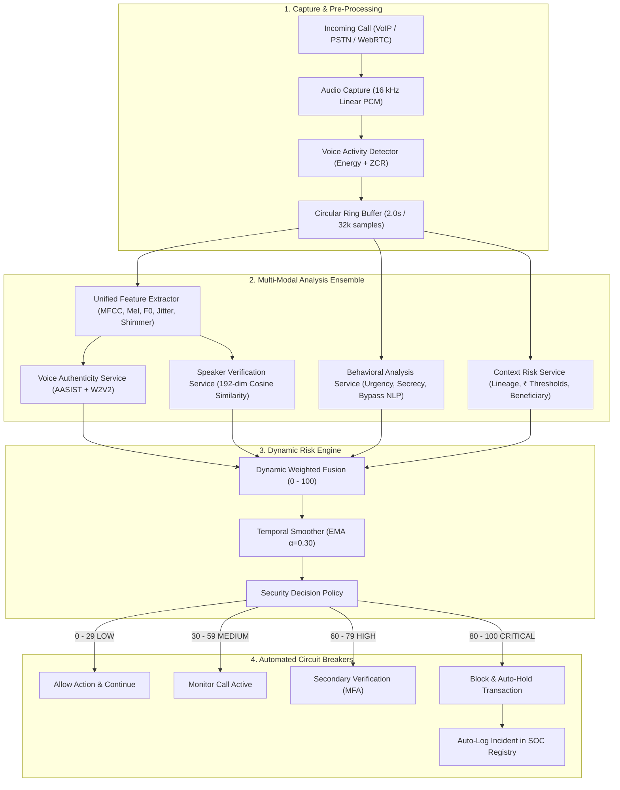

# VoiceShield AI — System Architecture & Data Flow

## 1. High-Level Architecture

VoiceShield AI implements an end-to-end defense-in-depth voice integrity verification platform that analyzes live audio streams in real time. Processing continuous **250ms chunks** over a **2.0s circular sliding window**, VoiceShield computes multi-modal acoustic, prosodic, biometric, behavioral, and transactional scores, outputting an authoritative, temporally smoothed risk verdict with **sub-300ms latency**.

## 2. Core Modules

| Module | Location | Primary Responsibility |
|:-------|:---------|:-----------------------|
| `VoiceAuthenticityService` | `backend/app/services/voice_authenticity.py` | Detects neural vocoder artifacts, diffusion patterns, high-frequency cutoffs |
| `SpeakerVerificationService` | `backend/app/services/speaker_verification.py` | 1:1 cosine distance verification against encrypted VIP voiceprints |
| `BehaviorAnalysisService` | `backend/app/services/behavior_analysis.py` | Detects high-pressure social engineering and policy bypass attempts |
| `ContextRiskService` | `backend/app/services/context_risk.py` | Correlates caller number recognition, transaction values, and beneficiary lineage |
| `RiskEngine` | `backend/app/services/risk_engine.py` | Multi-modal score fusion, EMA smoothing, explainability breakdown, fail-safe posture |
| `TransactionService` | `backend/app/services/transaction_service.py` | Enforces financial circuit breakers: auto-hold when risk &ge; 80 |
| `VerificationService` | `backend/app/services/verification_service.py` | Out-of-band mobile challenge (SMS OTP, Push MFA, Callback) dropping risk |
| `IncidentService` | `backend/app/services/incident_service.py` | Auto-registers security incident records and immutable SOC audit timeline |
