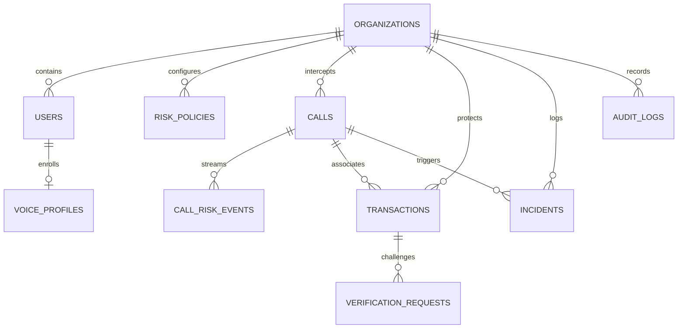

# VoiceShield AI — Database Specification

VoiceShield AI uses **PostgreSQL 16** with an automatic graceful fallback to **SQLite (`voiceshield.db`)** for zero-configuration local runs.

## Entity Relationship (ER) Diagram

## Tables Summary

1. `organizations`: Tenancy, domains, and global compliance parameters.
2. `users`: Enterprise users with roles (`EMPLOYEE`, `MANAGER`, `SECURITY_ANALYST`, `ADMIN`).
3. `risk_policies`: Dynamic weights, financial threshold (₹10,00,000), critical threshold (80).
4. `voice_profiles`: AES-256 encrypted 192-dim biometric embeddings. Zero raw audio stored.
5. `calls`: Inbound VoIP/PSTN call intercepts with status, duration, and final risk level.
6. `call_risk_events`: Sub-second telemetry logs containing decomposed scores and contributing factors.
7. `transactions`: Banking transaction records with status (`PENDING`, `ON_HOLD`, `VERIFICATION_REQUIRED`, `APPROVED`, `REJECTED`).
8. `verification_requests`: Secondary MFA and out-of-band callback challenges.
9. `incidents`: High-severity incidents (`risk >= 80`) with chronological forensic timelines.
10. `audit_logs`: Immutable audit trails for DPDP Act 2023 compliance.
